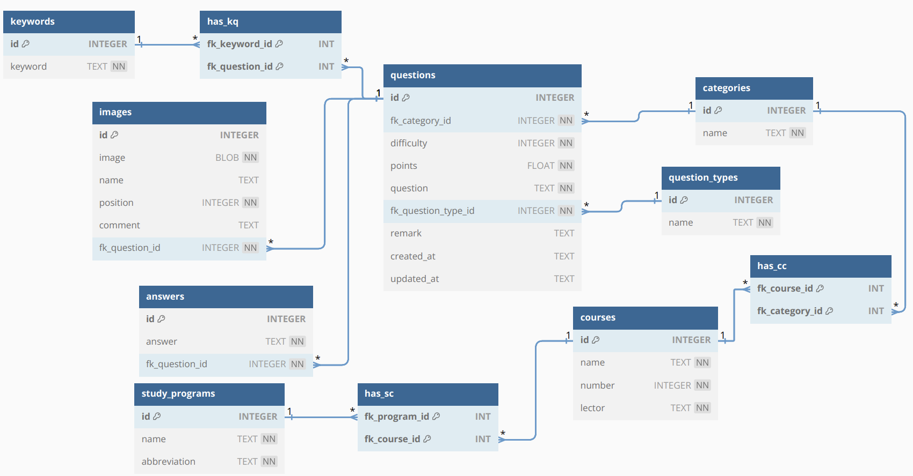

# ER-diagram

[<kbd>&larr; Go Back</kbd>](../../README.md)

[<kbd>**View how to create an ER-diagram** &rarr;</kbd>](how_to_create_er_diagram.md)

## Normalisierung nach den 3 Normalformen
### 1. Normalform
*Nur elementare Merkmalswerte sind erlaubt*

Werte der Attribute sind atomar (d.h keine zusammengesetzten Werte oder Mehrfachwerte)

### 2. Normalform
*abhängig von allen Schlüsselmerkmalen*

1.NF + Nichtschlüsselmerkmale sind von allen Schlüsselmerkmalen voll funktional abhängig.

### 3. Normalform
*nicht abhängig über Umwege*

3.NF = 2.NF + kein Nichtschlüsselmerkmal ist von irgendeinem Schlüssel transitiv 
(also indirekt, über Umwege) abhängig